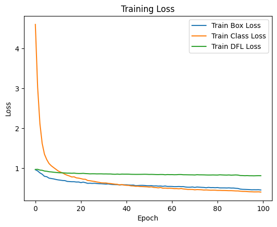
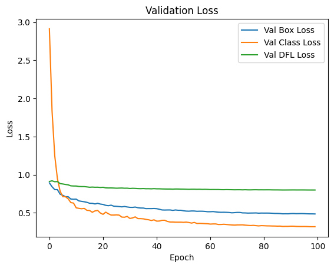
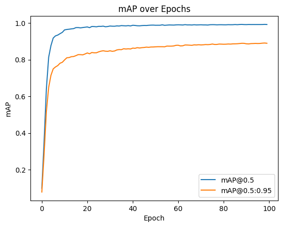
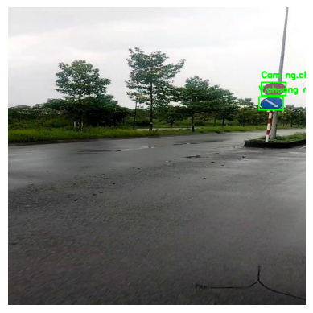

# Traffic Sign Recognition with YOLOv11

Nhận dạng biển báo giao thông Việt Nam (17 lớp) bằng YOLOv11.

## Tổng quan

- **Bài toán:** phát hiện và phân loại 17 loại biển báo giao thông Việt Nam từ ảnh/video thực tế trong điều kiện khó (trời mưa, thiếu sáng, biển nhỏ ở xa, bị che khuất)
- **Dữ liệu:** 7.999 ảnh, 17 lớp, quản lý trên Roboflow, chia train/val/test = 70/20/10
- **Mô hình:** YOLOv11n, huấn luyện trên Google Colab (GPU T4)

## Kết quả

| Metric | YOLOv8 | YOLOv11 |
|--------|--------|---------|
| Precision | 0.977 | **0.983** |
| Recall | 0.984 | **0.985** |
| mAP@0.5 | 0.990 | **0.992** |
| mAP@0.5:0.95 | 0.883 | **0.890** |

### Biểu đồ huấn luyện (100 epochs)

| Training loss | Validation loss | mAP |
|---|---|---|
|  |  |  |

### Kết quả detect mẫu

## Cách chạy

Mở notebook `yolov11_traffic_sign_train.ipynb` trên Google Colab (cần GPU):

1. Cài Ultralytics (cell đầu tiên)
2. Dataset được tải tự động từ [GitHub Release](https://github.com/davu442005tq/Traffic-Sign-Recognition-YOLOv11/releases/download/v1.0.0/Team2_VN_traffic_sign_detect.v1i.yolov11.zip) và giải nén vào `/content` (nếu không tải được, hãy upload file zip theo cách thủ công)
3. Chạy cell huấn luyện YOLOv11n (100 epochs, imgsz 640, batch 16, lr0 0.001, SGD)
4. Đánh giá trên test set và dự đoán trên ảnh/video thực tế

## Dataset

- **Nguồn:** bộ dữ liệu biển báo giao thông Việt Nam, 17 lớp, 7.999 ảnh (train/val/test = 70/20/10)
- **Tải về:** [Team2_VN_traffic_sign_detect.v1i.yolov11.zip](https://github.com/davu442005tq/Traffic-Sign-Recognition-YOLOv11/releases/download/v1.0.0/Team2_VN_traffic_sign_detect.v1i.yolov11.zip) (~651MB) trên GitHub Release

## Weights mô hình

- **Tải về:** [best.pt](https://github.com/davu442005tq/Traffic-Sign-Recognition-YOLOv11/releases/download/v1.0.0/best.pt) (5.5MB) – weights YOLOv11n sau huấn luyện, được tải tự động bởi notebook

## Demo

- [Video demo kết quả detect (GitHub Release)](https://github.com/davu442005tq/Traffic-Sign-Recognition-YOLOv11/releases)
- [Video demo kết quả detect (Google Drive)](https://drive.google.com/file/d/1Xkz8wqri_CpPOGARnq6c8fgVhRF26CmC/view?usp=drive_link)

## Thông tin nhóm

Dự án môn học – nhóm 3 thành viên.
